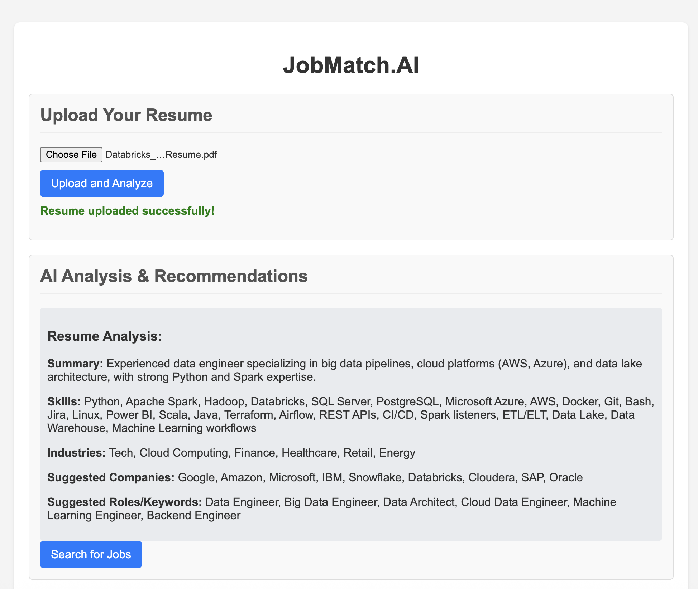
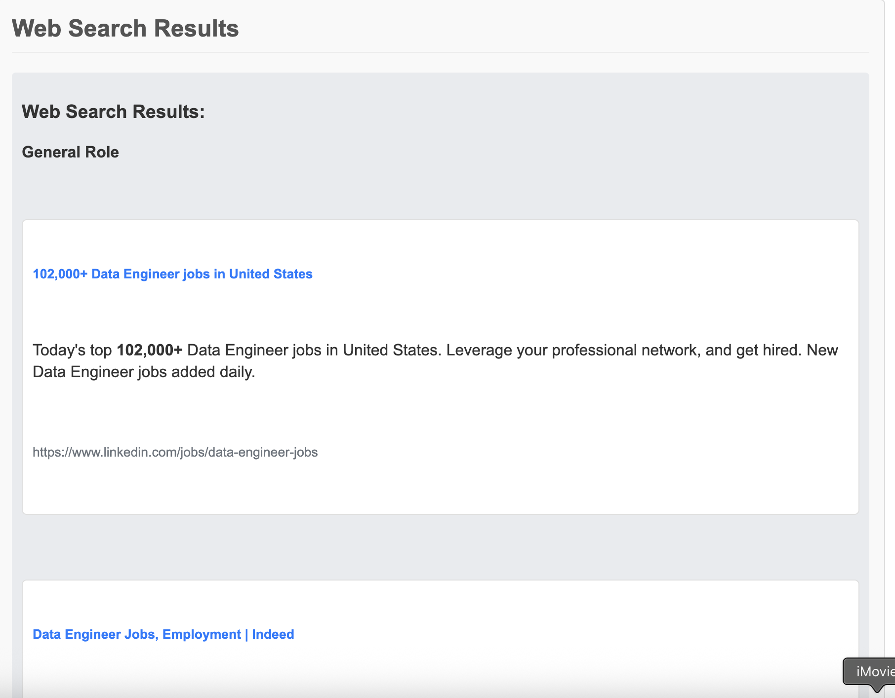

# JobMatch.AI

JobMatch.AI is an intelligent application designed to help users find relevant job opportunities by analyzing their resumes and leveraging AI-powered web searches. It utilizes a local Ollama large language model for resume analysis and integrates with a web search API to find matching job postings across the internet.

## Features

*   **Resume Upload:** Upload your resume (PDF format) for AI analysis.
*   **AI-Powered Resume Analysis:** A local Ollama model (`gpt-oss:latest` by default) analyzes your resume to extract key information such as:
    *   A concise summary of your profile.
    *   Key technical and soft skills.
    *   Relevant industries you'd be a good fit for.
    *   Suggested types of companies.
    *   Suggested job titles/keywords for searching.
*   **Intelligent Web Search:** Based on the AI's analysis, the application generates targeted search queries (e.g., specific roles at suggested companies) and uses the Brave Search API to find relevant job postings.
*   **Structured Search Results:** Web search results are consolidated and presented in an organized, user-friendly format, often grouped by the type of query.

## How It Works

JobMatch.AI follows a client-server architecture:

1.  **Frontend (HTML, CSS, JavaScript):**
    *   The user interface allows you to upload your resume.
    *   It sends the resume file to the Flask backend.
    *   It displays the AI analysis and web search results dynamically.

2.  **Backend (Python Flask):**
    *   Receives uploaded resumes.
    *   Parses the resume content (e.g., from PDF to text).
    *   Sends the resume text to the local Ollama server for AI analysis via an API call.
    *   Receives structured JSON analysis from Ollama.
    *   Generates targeted search queries based on Ollama's analysis.
    *   Makes requests to the Brave Search API.
    *   Consolidates web search results.
    *   Returns AI analysis and web search results to the frontend.

3.  **Ollama (Local AI Server):**
    *   A local instance of Ollama runs a large language model (e.g., `gpt-oss:latest`).
    *   It processes the resume text based on a detailed prompt and returns structured JSON output containing the analysis.

4.  **Brave Search API:**
    *   An external service used by the backend to perform web searches for job postings.

## Local Setup

Follow these steps to get JobMatch.AI up and running on your local machine.

### Prerequisites

*   **Python 3.8+:** [Download Python](https://www.python.org/downloads/)
*   **pip:** Python package installer (usually comes with Python).
*   **Ollama:** [Install Ollama](https://ollama.com/download)
*   **Ollama Model:** Download the `gpt-oss:latest` model (or `llama2`, `llama3.1` as alternatives) using the Ollama CLI:
    ```bash
    ollama pull gpt-oss:latest
    # or
    # ollama pull llama2
    ```
*   **Brave Search API Key:** Obtain a free API key from [Brave Search API](https://brave.com/search/api/).

### 1. Clone the Repository

(Assuming you are in the project root directory where you intend to create this project)
```bash

git clone https://github.com/cfkubo/JobMatch_AI
cd JobMatch_AI
```

### 2. Set up a Virtual Environment

It's recommended to use a Python virtual environment to manage dependencies.

```bash
python3 -m venv venv
```

### 3. Activate the Virtual Environment

*   **macOS / Linux:**
    ```bash
    source venv/bin/activate
    ```
*   **Windows:**
    ```bash
    .\venv\Scripts\activate
    ```

### 4. Install Python Dependencies

With your virtual environment activated, install the required Python packages:

```bash
pip install -r requirements.txt
```

### 5. Configure Environment Variables

Create a file named `.env` in the root directory of the project (where `app.py` is located). Add your Brave Search API key and the Ollama model you intend to use:

```
BRAVE_SEARCH_API_KEY=YOUR_BRAVE_SEARCH_API_KEY
OLLAMA_MODEL=gpt-oss # or llama2, llama3.1
```
Replace `YOUR_BRAVE_SEARCH_API_KEY` with your actual key.

## Running Locally

### 1. Start the Ollama Server

Ensure your local Ollama server is running in the background. If it's not already running, open a separate terminal and start it:

```bash
ollama serve
```

### 2. Run the Flask Application

In your project's terminal (with the virtual environment activated):

```bash
./venv/bin/python3 app.py
```
You should see output indicating that the Flask development server is running, typically on `http://127.0.0.1:5000/`.

### 3. Access the Application

Open your web browser and navigate to:

```
http://127.0.0.1:5000/
```

## Usage

1.  **Upload Resume:** Click the "Choose File" button to select your resume (PDF format).
2.  **Analyze:** Click "Upload and Analyze". The AI will process your resume, and the "AI Analysis & Recommendations" section will populate with a summary, skills, industries, suggested companies, and roles.
3.  **Search Jobs:** Once the analysis is complete, click "Search for Jobs". The application will use the AI's recommendations to perform targeted web searches, and the "Web Search Results" section will display the findings.

## Future Enhancements

*   Support for additional resume formats (DOCX, TXT).
*   More advanced resume parsing and information extraction.
*   Integration of embedding models for semantic job matching and RAG.
*   Integration with dedicated job board APIs (e.g., LinkedIn, Indeed) for more comprehensive job searches.
*   User accounts and personalized job tracking.


# Screenshots





## Contributing

This project is proof of concept and I belive a lot cloud be improved. Please feel free to fork and implement your ideas


